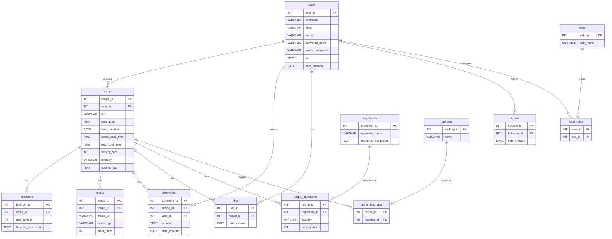

# 🍽️ RecipeNest Database

A full-featured relational database for a recipe-sharing platform built with MySQL. The system supports users, recipes, ingredients, directions, media, comments, likes, follows, hashtags, and role-based permissions.

---

## 📌 Overview

This database models a complete social recipe platform where:

- Users can create and manage recipes  
- Recipes contain structured ingredients and step-by-step directions  
- Users can interact through likes, comments, and follows  
- Recipes can include media (images/videos)  
- Recipes can be categorized using hashtags  
- Role-based access control supports admins and users  

---

## 🧠 Database Design

- Fully normalized relational design  
- Many-to-many relationships handled with junction tables  
- Foreign keys enforce referential integrity  
- Uses standard MySQL types (`INT`, `VARCHAR`, `TEXT`, `DATE`, `TIME`)  

---

## 📊 ER Diagram


---
## SQL schema (reference)

```sql
CREATE DATABASE RecipeNest;
USE RecipeNest;

CREATE TABLE Users (
    UserID INT PRIMARY KEY AUTO_INCREMENT,
    Username VARCHAR(50) UNIQUE,
    Email VARCHAR(100) UNIQUE,
    Name VARCHAR(100),
    PasswordHash VARCHAR(255),
    ProfilePictureURL VARCHAR(255),
    Bio TEXT,
    DateCreation DATE
);

CREATE TABLE Recipes (
    RecipeID INT PRIMARY KEY AUTO_INCREMENT,
    UserID INT NOT NULL,
    Title VARCHAR(100),
    Description TEXT,
    DateCreation DATE,
    ActiveCookTime TIME,
    TotalCookTime TIME,
    ServingSize INT,
    Difficulty VARCHAR(50),
    CookingTips TEXT,
    FOREIGN KEY (UserID) REFERENCES Users(UserID)
);

CREATE TABLE Ingredients (
    IngredientID INT PRIMARY KEY AUTO_INCREMENT,
    IngredientName VARCHAR(100),
    IngredientDescription TEXT
);

CREATE TABLE RecipeIngredients (
    RecipeID INT,
    IngredientID INT,
    Quantity VARCHAR(50),
    OrderIndex INT,
    PRIMARY KEY (RecipeID, IngredientID),
    FOREIGN KEY (RecipeID) REFERENCES Recipes(RecipeID),
    FOREIGN KEY (IngredientID) REFERENCES Ingredients(IngredientID)
);

CREATE TABLE Directions (
    DirectionID INT PRIMARY KEY AUTO_INCREMENT,
    RecipeID INT,
    StepNumber INT,
    DirectionDescription TEXT,
    FOREIGN KEY (RecipeID) REFERENCES Recipes(RecipeID)
);

CREATE TABLE Media (
    MediaID INT PRIMARY KEY AUTO_INCREMENT,
    RecipeID INT NOT NULL,
    MediaURL VARCHAR(255),
    MediaType ENUM('image', 'video'),
    OrderIndex INT,
    FOREIGN KEY (RecipeID) REFERENCES Recipes(RecipeID)
);

CREATE TABLE Comments (
    CommentID INT PRIMARY KEY AUTO_INCREMENT,
    RecipeID INT NOT NULL,
    UserID INT NOT NULL,
    Content TEXT,
    DateCreation DATE,
    FOREIGN KEY (RecipeID) REFERENCES Recipes(RecipeID),
    FOREIGN KEY (UserID) REFERENCES Users(UserID)
);

CREATE TABLE Likes (
    UserID INT,
    RecipeID INT,
    DateCreation DATE,
    PRIMARY KEY (UserID, RecipeID),
    FOREIGN KEY (UserID) REFERENCES Users(UserID),
    FOREIGN KEY (RecipeID) REFERENCES Recipes(RecipeID)
);

CREATE TABLE Hashtags (
    HashtagID INT PRIMARY KEY AUTO_INCREMENT,
    Name VARCHAR(50) UNIQUE
);

CREATE TABLE RecipeHashtags (
    RecipeID INT,
    HashtagID INT,
    PRIMARY KEY (RecipeID, HashtagID),
    FOREIGN KEY (RecipeID) REFERENCES Recipes(RecipeID),
    FOREIGN KEY (HashtagID) REFERENCES Hashtags(HashtagID)
);

CREATE TABLE Follows (
    FollowerID INT,
    FollowingID INT,
    DateCreation DATE,
    PRIMARY KEY (FollowerID, FollowingID),
    FOREIGN KEY (FollowerID) REFERENCES Users(UserID),
    FOREIGN KEY (FollowingID) REFERENCES Users(UserID)
);

