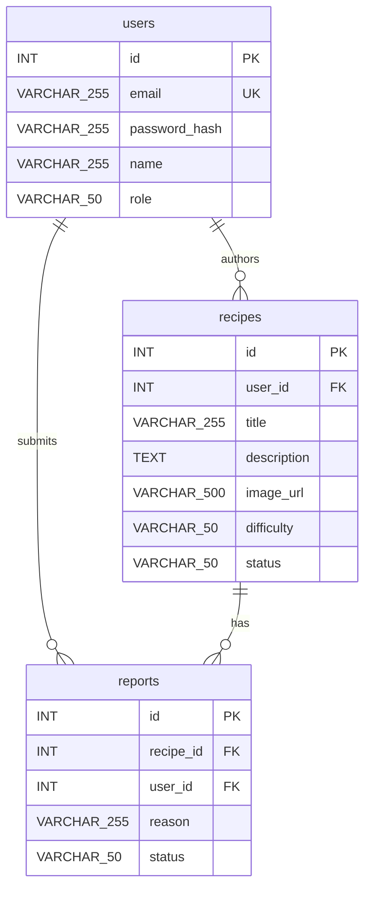

# RecipeNest – Database ERD (SQL)

Three tables: **users**, **recipes**, **reports**. Naming and types follow SQL conventions (snake_case, standard types).

---

## Database design description (short)

There are three tables. The users table holds accounts and a role (user or admin). The recipes table holds the title, description, image, difficulty, and status, and each recipe is tied to its author by user_id. The reports table stores which recipe was reported, who reported it, the reason, and a status for admin to review. A user can have many recipes and many reports; a recipe can have many reports. We use normal SQL: snake_case names, integer primary keys, and VARCHAR or TEXT for the rest. Ingredients and directions can be stored as text on recipes if we need them later.

---

## ER diagram (Mermaid)

View on [Mermaid Live](https://mermaid.live), in GitHub, or in VS Code with a Mermaid extension.



---

## SQL schema (reference)

```sql
-- Users: accounts and admins
CREATE TABLE users (
    id              INT PRIMARY KEY AUTO_INCREMENT,
    email           VARCHAR(255) NOT NULL UNIQUE,
    password_hash   VARCHAR(255) NOT NULL,
    name            VARCHAR(255),
    role            VARCHAR(50) DEFAULT 'user'  -- 'user' or 'admin'
);

-- Recipes: author = user_id
CREATE TABLE recipes (
    id          INT PRIMARY KEY AUTO_INCREMENT,
    user_id     INT NOT NULL,
    title       VARCHAR(255) NOT NULL,
    description TEXT,
    image_url   VARCHAR(500),
    difficulty  VARCHAR(50),   -- e.g. 'Easy', 'Medium', 'Hard'
    status      VARCHAR(50) DEFAULT 'draft',  -- 'draft' or 'published',
    FOREIGN KEY (user_id) REFERENCES users(id)
);

-- Reports: user reports on recipes (admin moderation)
CREATE TABLE reports (
    id         INT PRIMARY KEY AUTO_INCREMENT,
    recipe_id  INT NOT NULL,
    user_id    INT NOT NULL,
    reason     VARCHAR(255),
    status     VARCHAR(50) DEFAULT 'pending',  -- 'pending', 'reviewed', 'dismissed',
    FOREIGN KEY (recipe_id) REFERENCES recipes(id),
    FOREIGN KEY (user_id) REFERENCES users(id)
);
```

---

## Summary

| Table     | Purpose |
|-----------|---------|
| **users**   | Accounts (email, password_hash, name, role). |
| **recipes** | Recipes (title, description, image_url, difficulty, status). `user_id` = author. Ingredients/directions can be stored as TEXT columns if needed. |
| **reports** | User reports on recipes (reason, status) for admin moderation. |

**Relationships:** One user has many recipes; one user has many reports; one recipe has many reports.
